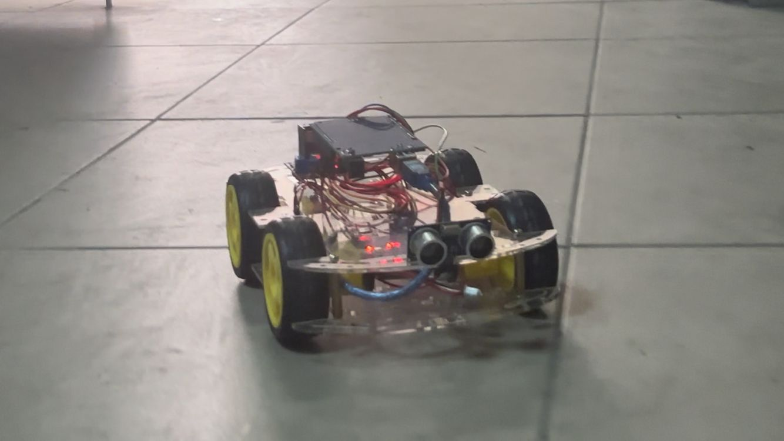

# Arduino ile Engelden Kaçan Otonom Araç
Bu proje, Arduino tabanlı otonom bir robot araç geliştirmeyi amaçlamaktadır. Araç, ön kısmına yerleştirilen HC-SR04 ultrasonik sensör yardımıyla çevresindeki engelleri algılar ve engel tespit edildiğinde otomatik olarak yön değiştirerek yoluna devam eder.
Sistem tamamen otonom çalışacak şekilde tasarlanmıştır ve herhangi bir uzaktan kontrol gerektirmez. Bu sayede robot, bulunduğu ortamda sürekli olarak hareket eder ve karşılaştığı engellerden kaçınarak ilerleyebilir.



## Kullanılan Malzemeler
-Arduino Uno
-HC-SR04 Ultrasonik Mesafe Sensörü
-L298N Motor Sürücü Modülü
-4 Adet DC Motor
-Araç Şasesi ve Tekerlekler
-Batarya
-Jumper Kablolar

### Çalışma Prensibi
Ultrasonik sensör sürekli olarak önündeki mesafeyi ölçer. Ölçülen mesafe belirlenen sınır değerin altına düştüğünde sistem bunu bir engel olarak algılar.
Arduino, motor sürücü modülüne komut göndererek aracın yönünü değiştirir. Araç önce durur, ardından sağa dönerek engeli aşar ve tekrar ileri hareket etmeye başlar.
Bu sayede araç bulunduğu ortamda engellere çarpmadan sürekli hareket edebilir.

### Proje Özellikleri
-Otonom hareket sistemi
-Ultrasonik sensör ile mesafe algılama
-Motor sürücü ile çift motor kontrolü
-Engelden kaçma algoritması
-Basit ve geliştirilebilir robot altyapısı

### Geliştirme Fikirleri
Proje aşağıdaki özellikler eklenerek geliştirilebilir:
-Birden fazla sensör ile her taraftan tarama yaparak daha emin ve kontrollü ilerleme
-Sensör ile çizgi takip özelliği eklenmesi
-Bluetooth ile manuel kontrol modu
-LCD ekran ile mesafe ve engel gösterimi

```cpp
#define pwm 13
#define pwm2 9
#define in1 12
#define in2 11
#define in3 10
#define in4 8
const int pinPin = 7;
#define trigPin 4
#define echoPin 5
long sure;
int mesafe;

void setup() {

  Serial.begin(9600);
  pinMode(trigPin, OUTPUT);
  pinMode(echoPin, OUTPUT);
  pinMode(in1, OUTPUT);
  pinMode(in2, OUTPUT);
  pinMode(in3, OUTPUT);
  pinMode(in4, OUTPUT);
  pinMode(pwm, OUTPUT);
  pinMode(pwm2, OUTPUT);

}

void loop() {

  digitalWrite(trigPin, 0);
  delayMicroseconds(2);
  digitalWrite(trigPin, 1);
  delayMicroseconds(10);
  digitalWrite(trigPin, 0);
  sure = pulseIn(echoPin, 1);
  mesafe = (sure*.0343)/2;

  digitalWrite(in1 ,0);
  digitalWrite(in2 ,1);
  digitalWrite(pwm ,255);
  digitalWrite(in3 ,0);
  digitalWrite(in4 ,1);
  digitalWrite(pwm2 ,255);

  if(mesafe<30)
  {
    digitalWrite(in1 ,1);
    digitalWrite(in2 ,1);
    digitalWrite(pwm ,0);
    digitalWrite(in3 ,1);
    digitalWrite(in4 ,1);
    digitalWrite(pwm2 ,0);

    delay(1000);
    
  digitalWrite(in1 ,1);
  digitalWrite(in2 ,0);
  digitalWrite(pwm ,255);
  digitalWrite(in3 ,1);
  digitalWrite(in4 ,0);
  digitalWrite(pwm2 ,255);

  delay(500);

  digitalWrite(in1 ,1);
  digitalWrite(in2 ,0);
  digitalWrite(pwm ,50);
  digitalWrite(in3 ,0);
  digitalWrite(in4 ,1);
  digitalWrite(pwm2 ,50);

  delay(700);
  }

  else
  {
  digitalWrite(in1 ,0);
  digitalWrite(in2 ,1);
  digitalWrite(pwm ,255);
  digitalWrite(in3 ,0);
  digitalWrite(in4 ,1);
  digitalWrite(pwm2 ,255);
  }

}

```cpp
